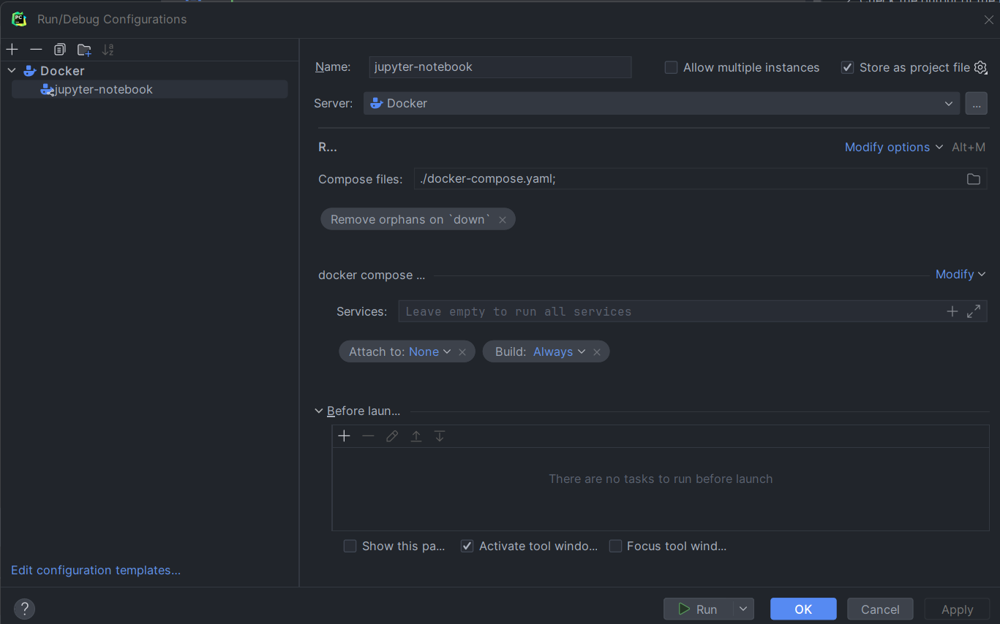
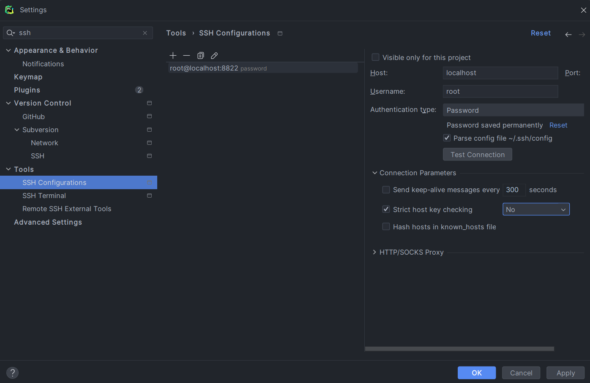
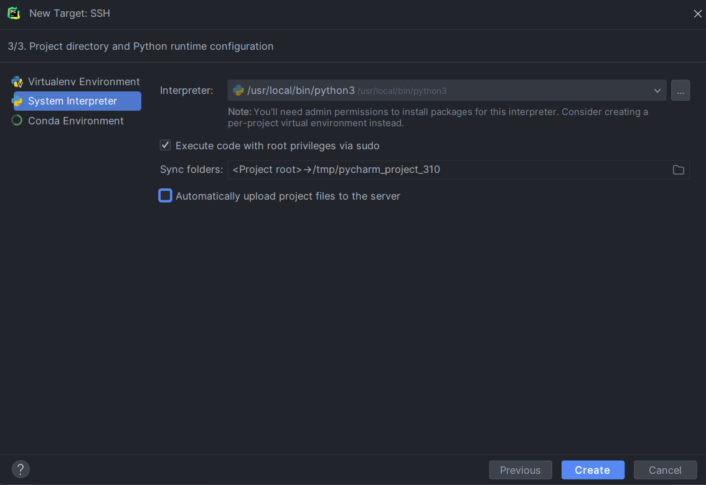

This project is a template to run your juypter notebooks in a docker container and connect your PyCharm to the docker
for the interpreter. The main reason for this is to have a reproducible environment and change the python version
without installing it on your local machine.

The main motivation for this project was a course at the University of Applied Sciences in Lucerne (HSLU), where we were
provided with a Google colab notebook. Google Colab changed the python version and forced us to run it locally.

## Docker Compose Configuration

## Interpreter

