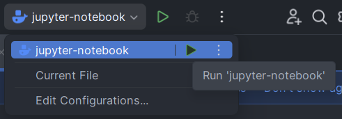
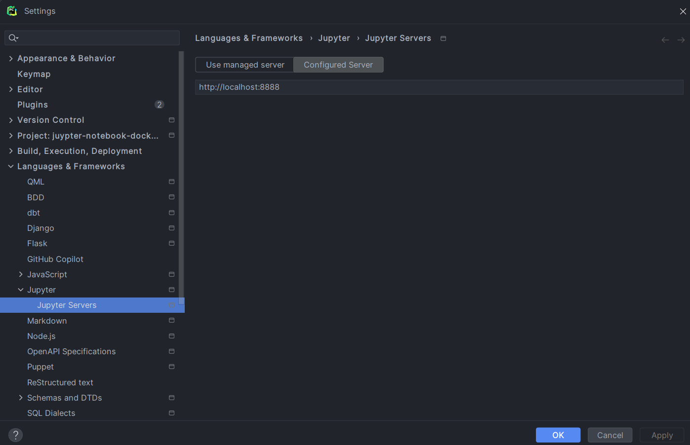

This project is a template to run your juypter notebooks in a docker container and connect your Python interpreter to 
said notebook. The main reason for this is to have a reproducible environment and change the python version without 
installing it on your local machine.

The main motivation for this project was a course at the University of Applied Sciences in Lucerne (HSLU), where we were
provided with a Google colab notebook. Google Colab changed the python version and broke the dependencies. 

## Run the project

*Requires docker to be installed*
To run this project, you need to configure a couple of things:

### Run the docker compose
First Run the "jupyter-notebook" run config. This will start the docker
container 

### Configure SSH
Add a new ssh connection in PyCharm. `Settings -> Tools -> SSH Configurations` and click on the `+` button.
 - IP: `localhost`
 - Port: `8822`
 - username: `root`
 - password: `rootpassword`
 - Set `Strict host key checking` to `no` 

### Add Remote Interpreter
Add a new remote interpreter in PyCharm. `Settings -> Project -> Python Interpreter` and click `Add Interpreter -> SSH Interpreter`
    - Important: You need to change the python runtime configuration to `System Interpreter`,
    - check `Execute code with rood privileges via sudo` and turn off `Automatically upload project files to the server`

### Add Jupyter Server
Finally, change your jupyter server. `Settings -> Languages & Frameworks -> Jupyter -> Jupyter Server`
 - Switch to Configured Server
 - Add the URL `http://localhost:8888`
 

**Happy coding 🥳!**

### Docker Compose Configuration

## Contributing

Pull requests are welcome. Don't hesitate to open an issue if you have any questions or suggestions.
